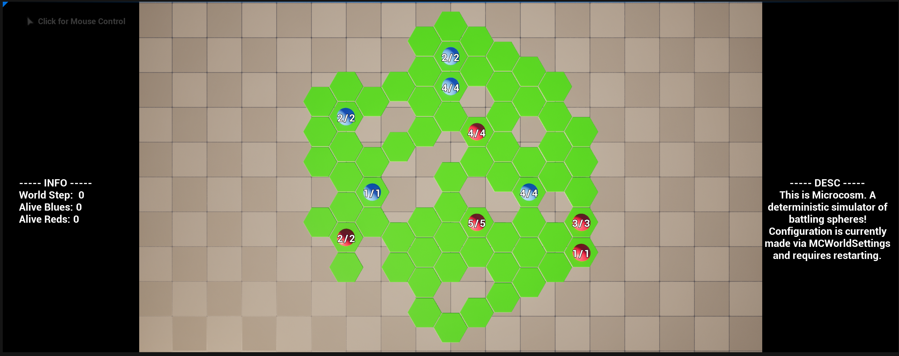
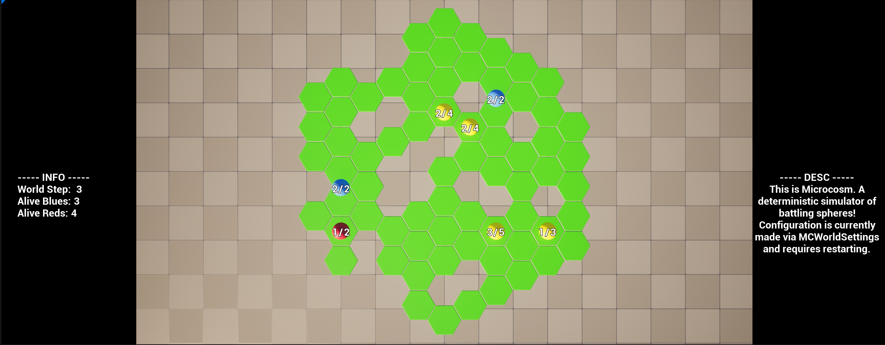
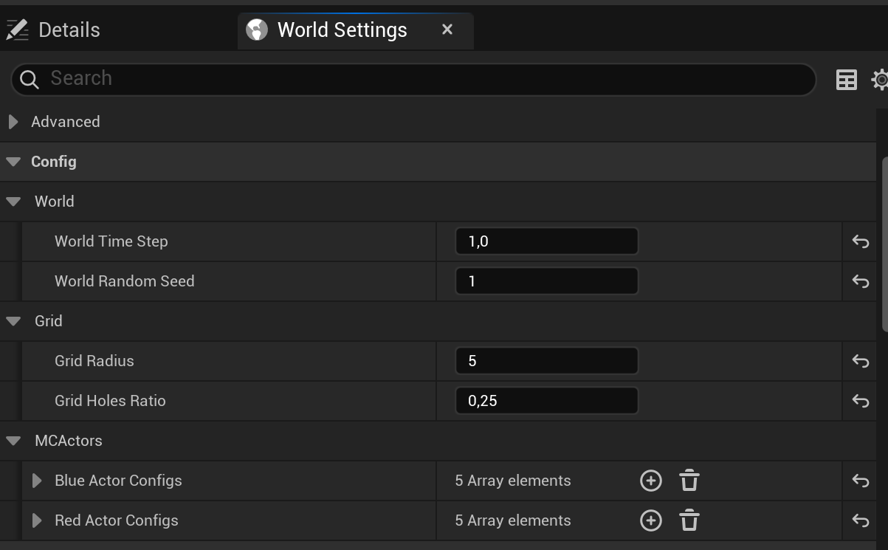
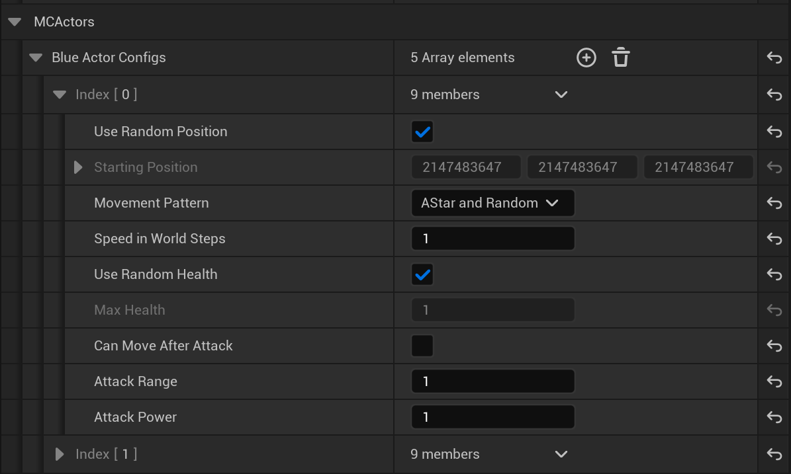

# Microcosm: A Deterministic Simulation and Visualization

This project implements a deterministic simulation for an auto battle mode, developed entirely in C++ within Unreal Engine, focusing on deterministic simulation and a real-time visualization of the simulation.


## Project Overview

The simulation is built on a **hexagonal grid system** and features:
- A deterministic simulation advancing in discrete time steps.
- Two units (a red ball and a blue ball) that:
  - Start on random hexagonal grid cells.
  - Move towards each other using the **A* pathfinding algorithm**.
  - Engage in combat when within a defined range.
  - Display hits and deaths visually as per the requirements.
- Randomized hit points determining how many attacks each ball can endure.

### Hexagonal Grid Implementation

The simulation uses a hexagonal grid system with axial coordinates instead of a traditional box grid. This enhances movement dynamics and introduces new challenges for pathfinding and navigation. The hex grid is implemented to ensure:
- Consistency in grid layout and deterministic simulation.
- Accurate calculations of distances and movement between cells.
- Improved visualization of unit movement and interactions.

### Dynamic Camera System

A **dynamic camera system** was implemented to adapt to the grid size:
- Automatically adjusts zoom levels and viewing angles based on the grid's dimensions.
- Ensures all active units and grid elements remain within view for an optimal simulation experience.
- Smooth transitions for camera movements to enhance visual appeal.

### Additional Features
- Smooth visualization with linear interpolation (lerping) for movements.
- Additional red and blue units added to enhance complexity.
- Basic navigation mechanics to allow balls to move around each other.

## Requirements Fulfilled

This project adheres to the provided task requirements:
- Simulation is deterministic, ensuring consistent outcomes across runs.
- A hexagonal grid-based system was implemented for unit movement.
- Visual cues depict states such as movement, attacking, and death.
- Pathfinding is handled using the A* algorithm for optimal performance.
- A dynamic camera system ensures scalability and adaptability.
- The grid supports variable ratios of holes while maintaining connectivity.
- The source code is entirely in C++ except for minor visual enhancements handled via Blueprints.

Extra features, including continuous visualization, the addition of multiple units, and navigation around units, were also implemented.

### Simulation World Configuration

The behavior of the simulation world can be configured using the following properties:

- **Simulation Speed**:
  - Set the speed of the simulation via the `WorldTimeStep` parameter. A smaller value increases simulation smoothness (default: 0.1 seconds per step).

- **Random Seed**:
  - Configure the deterministic simulation seed via `WorldRandomSeed`. A value of `0` generates a random seed.

- **Hex Grid Radius**:
  - Specify the radius of the hex grid with `GridRadius` to define the playable area (default: 4).

- **Holes Ratio**:
  - Set the ratio of holes in the grid using `GridHolesRatio` while ensuring connectivity (default: 0.1).

### Simulation Actor Configuration

The behavior of simulation actors can be configured using the following properties:

- **Random Positioning**:
  - Enable or disable random placement on the grid.
  - If disabled, specify a starting position.

- **Movement Behavior**:
  - Define how units move using the `EMovementPattern` setting, such as A* pathfinding or random movement.

- **Speed**:
  - Specify the number of steps a unit must wait before moving again. A value of `1` means maximum speed.

- **Health Settings**:
  - Randomize maximum health or specify a fixed value.

- **Attack Behavior**:
  - Configure whether a unit can move after attacking.
  - Set the attack range and power.

## Images

### Initial State


### Simulation in Progress


### World Settings - Configuration 1


### World Settings - Configuration 2


## Getting Started

### Prerequisites
- **Unreal Engine 5.5** is required.
- C++ development environment compatible with Unreal Engine.

### Installation
1. Clone the repository:
   ```bash
   git clone https://github.com/ZimaXXX/Microcosm
   ```
2. Open the project in **Unreal Engine 5.5**.
3. Build and run the project to see the simulation.

## Notes

- The simulation has been tested for determinism and real-time visualization.
- Detailed explanations of decision-making and additional implementation details can be found in the comments within the code.

## License
This project is for demonstration purposes as part of the Microcosm simulation task. Redistribution or sharing beyond authorized parties is not permitted.
